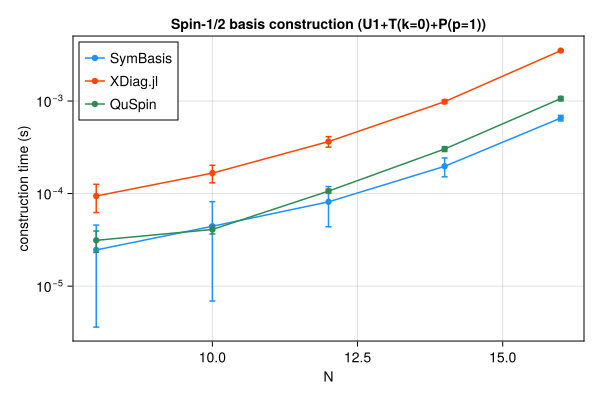
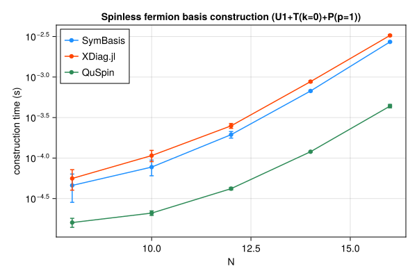
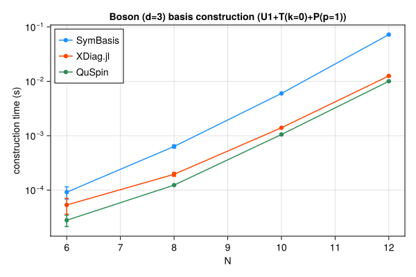

# Benchmarks

Symmetry-resolved basis construction and representative-state lookup speed, compared against [XDiag.jl](https://github.com/awietek/XDiag.jl) and [QuSpin](https://quspin.github.io/QuSpin/). SymBasis is benchmarked against its own dev checkout; XDiag.jl and QuSpin are whatever their latest released versions were at the time this page was generated. Regenerated automatically on every SymBasis release.

Sweep: `BENCH_SWEEP=quick`

### Spin-1/2 — basis construction

| N | config | dim | SymBasis | XDiag | QuSpin | XDiag/SymBasis | QuSpin/SymBasis |
|---|---|---|---|---|---|---|---|
| 8 | U1 | 70 | 2.683e-05 ± 1.9e-05 s | 1.821e-06 ± 4e-06 s | 1.419e-05 ± 6.9e-06 s | 0.07x | 0.53x |
| 8 | U1+T(k=0) | 10 | 3.19e-05 ± 2e-05 s | 3.078e-05 ± 1.9e-05 s | 1.478e-05 ± 4.1e-06 s | 0.97x | 0.46x |
| 8 | U1+T(k=0)+P(p=1) | 8 | 3.765e-05 ± 1.8e-05 s | 5.405e-05 ± 1.6e-05 s | 1.966e-05 ± 8.6e-06 s | 1.44x | 0.52x |
| 10 | U1 | 252 | 3.06e-05 ± 1.8e-05 s | 1.616e-06 ± 3.1e-06 s | 1.207e-05 ± 1.9e-06 s | 0.05x | 0.39x |
| 10 | U1+T(k=0) | 26 | 3.715e-05 ± 1.7e-05 s | 4.903e-05 ± 1.1e-05 s | 1.581e-05 ± 1.7e-06 s | 1.32x | 0.43x |
| 10 | U1+T(k=0)+P(p=1) | 16 | 4.772e-05 ± 1.6e-05 s | 0.0001002 ± 1.9e-05 s | 2.011e-05 ± 1.3e-06 s | 2.10x | 0.42x |
| 12 | U1 | 924 | 3.565e-05 ± 1.9e-05 s | 2.279e-06 ± 4.6e-06 s | 1.595e-05 ± 1.3e-06 s | 0.06x | 0.45x |
| 12 | U1+T(k=0) | 80 | 7.561e-05 ± 2.6e-05 s | 0.0001419 ± 1.4e-05 s | 2.688e-05 ± 1.2e-06 s | 1.88x | 0.36x |
| 12 | U1+T(k=0)+P(p=1) | 50 | 8.245e-05 ± 1.7e-05 s | 0.0002306 ± 1.7e-05 s | 4.09e-05 ± 1.1e-06 s | 2.80x | 0.50x |
| 14 | U1 | 3432 | 7.022e-05 ± 1.4e-05 s | 2.329e-06 ± 3.3e-06 s | 2.706e-05 ± 8.5e-07 s | 0.03x | 0.39x |
| 14 | U1+T(k=0) | 246 | 0.0001086 ± 1.4e-05 s | 0.0005519 ± 3.4e-05 s | 6.427e-05 ± 1.2e-06 s | 5.08x | 0.59x |
| 14 | U1+T(k=0)+P(p=1) | 133 | 0.0001879 ± 1.9e-05 s | 0.0006895 ± 3.1e-05 s | 0.0001201 ± 2.4e-06 s | 3.67x | 0.64x |
| 16 | U1 | 12870 | 0.0001436 ± 2.2e-05 s | 3.304e-06 ± 3.1e-06 s | 6.988e-05 ± 1.1e-06 s | 0.02x | 0.49x |
| 16 | U1+T(k=0) | 810 | 0.0003224 ± 2.6e-05 s | 0.002245 ± 3.8e-05 s | 0.0002156 ± 2e-05 s | 6.96x | 0.67x |
| 16 | U1+T(k=0)+P(p=1) | 440 | 0.0006064 ± 1.4e-05 s | 0.002646 ± 6.7e-05 s | 0.0004222 ± 3e-06 s | 4.36x | 0.70x |

### Spin-1/2 — representative lookup (seconds/call, amortized over batch)

| N | config | nsamples | SymBasis | XDiag | QuSpin |
|---|---|---|---|---|---|
| 16 | U1+T(k=0)+P(p=1) | 10000 | 1.508e-07 ± 3e-09 s | N/A (no decoupled API) | 5.822e-07 ± 6.1e-09 s |

### Spinless fermion — basis construction

| N | config | dim | SymBasis | XDiag | QuSpin | XDiag/SymBasis | QuSpin/SymBasis |
|---|---|---|---|---|---|---|---|
| 8 | U1 | 70 | 2.573e-05 ± 2.4e-05 s | 1.487e-06 ± 2.9e-06 s | 1.415e-05 ± 4.5e-06 s | 0.06x | 0.55x |
| 8 | U1+T(k=0) | 9 | 3.194e-05 ± 2e-05 s | 2.431e-05 ± 1.2e-05 s | 1.402e-05 ± 2.7e-06 s | 0.76x | 0.44x |
| 8 | U1+T(k=0)+P(p=1) | 6 | 4.595e-05 ± 1.8e-05 s | 5.604e-05 ± 1.6e-05 s | 1.6e-05 ± 2e-06 s | 1.22x | 0.35x |
| 10 | U1 | 252 | 2.841e-05 ± 1.8e-05 s | 1.738e-06 ± 3.1e-06 s | 1.187e-05 ± 1e-06 s | 0.06x | 0.42x |
| 10 | U1+T(k=0) | 26 | 5.22e-05 ± 1.7e-05 s | 6.421e-05 ± 1.4e-05 s | 1.655e-05 ± 1.2e-06 s | 1.23x | 0.32x |
| 10 | U1+T(k=0)+P(p=1) | 16 | 7.737e-05 ± 1.7e-05 s | 0.0001073 ± 1.7e-05 s | 2.093e-05 ± 1.4e-06 s | 1.39x | 0.27x |
| 12 | U1 | 924 | 3.328e-05 ± 1.6e-05 s | 1.896e-06 ± 2.9e-06 s | 1.6e-05 ± 1e-06 s | 0.06x | 0.48x |
| 12 | U1+T(k=0) | 76 | 0.0001063 ± 1.7e-05 s | 0.0001801 ± 1.5e-05 s | 2.689e-05 ± 1.2e-06 s | 1.69x | 0.25x |
| 12 | U1+T(k=0)+P(p=1) | 33 | 0.0001944 ± 1.8e-05 s | 0.0002499 ± 1.7e-05 s | 4.193e-05 ± 1.6e-06 s | 1.29x | 0.22x |
| 14 | U1 | 3432 | 7.278e-05 ± 1.1e-05 s | 3.146e-06 ± 4e-06 s | 2.858e-05 ± 4.3e-06 s | 0.04x | 0.39x |
| 14 | U1+T(k=0) | 246 | 0.0003237 ± 1.9e-05 s | 0.0007125 ± 2.6e-05 s | 6.611e-05 ± 2.7e-06 s | 2.20x | 0.20x |
| 14 | U1+T(k=0)+P(p=1) | 113 | 0.0006727 ± 1.5e-05 s | 0.0008784 ± 2.2e-05 s | 0.0001198 ± 1.4e-06 s | 1.31x | 0.18x |
| 16 | U1 | 12870 | 0.0001519 ± 2.2e-05 s | 3.65e-06 ± 3.1e-06 s | 7.016e-05 ± 8.6e-07 s | 0.02x | 0.46x |
| 16 | U1+T(k=0) | 809 | 0.001243 ± 2.8e-05 s | 0.002884 ± 3.5e-05 s | 0.0002065 ± 1.6e-06 s | 2.32x | 0.17x |
| 16 | U1+T(k=0)+P(p=1) | 422 | 0.002716 ± 4.5e-05 s | 0.003261 ± 7.4e-05 s | 0.000438 ± 2.1e-05 s | 1.20x | 0.16x |

### Spinless fermion — representative lookup (seconds/call, amortized over batch)

| N | config | nsamples | SymBasis | XDiag | QuSpin |
|---|---|---|---|---|---|
| 16 | U1+T(k=0)+P(p=1) | 10000 | 1.187e-06 ± 5.4e-09 s | N/A (no decoupled API) | 3.817e-06 ± 5.5e-08 s |

### Boson (d=3) — basis construction

| N | config | dim | SymBasis | XDiag | QuSpin | XDiag/SymBasis | QuSpin/SymBasis |
|---|---|---|---|---|---|---|---|
| 6 | U1 | 141 | 4.124e-05 ± 2e-05 s | 1.992e-06 ± 3.1e-06 s | 1.656e-05 ± 6.1e-06 s | 0.05x | 0.40x |
| 6 | U1+T(k=0) | 26 | 7.616e-05 ± 1.9e-05 s | 2.744e-05 ± 1.1e-05 s | 2.108e-05 ± 3.2e-06 s | 0.36x | 0.28x |
| 6 | U1+T(k=0)+P(p=1) | 18 | 9.155e-05 ± 2.3e-05 s | 5.324e-05 ± 1.7e-05 s | 2.788e-05 ± 6.5e-06 s | 0.58x | 0.30x |
| 8 | U1 | 1107 | 0.0001331 ± 1.9e-05 s | 3.733e-06 ± 4.1e-06 s | 3.004e-05 ± 1.9e-06 s | 0.03x | 0.23x |
| 8 | U1+T(k=0) | 142 | 0.0003948 ± 2.2e-05 s | 0.0001411 ± 1.3e-05 s | 8.195e-05 ± 2.4e-06 s | 0.36x | 0.21x |
| 8 | U1+T(k=0)+P(p=1) | 84 | 0.0006344 ± 4.2e-05 s | 0.000195 ± 1.6e-05 s | 0.0001234 ± 2.4e-06 s | 0.31x | 0.19x |
| 10 | U1 | 8953 | 0.001063 ± 4.9e-05 s | 6.513e-06 ± 4.6e-06 s | 0.0001651 ± 1.3e-05 s | 0.01x | 0.16x |
| 10 | U1+T(k=0) | 902 | 0.003946 ± 3.4e-05 s | 0.0012 ± 1.5e-05 s | 0.000752 ± 1.6e-05 s | 0.30x | 0.19x |
| 10 | U1+T(k=0)+P(p=1) | 486 | 0.005992 ± 5.6e-05 s | 0.0014 ± 3.1e-05 s | 0.001053 ± 4.3e-05 s | 0.23x | 0.18x |
| 12 | U1 | 73789 | 0.01137 ± 0.00019 s | 1.675e-05 ± 3.9e-06 s | 0.001218 ± 5.4e-05 s | 0.00x | 0.11x |
| 12 | U1+T(k=0) | 6166 | 0.05067 ± 0.00017 s | 0.01121 ± 3.9e-05 s | 0.007229 ± 0.00012 s | 0.22x | 0.14x |
| 12 | U1+T(k=0)+P(p=1) | 3179 | 0.0724 ± 0.00017 s | 0.01257 ± 0.00012 s | 0.01004 ± 0.0001 s | 0.17x | 0.14x |

### Boson (d=3) — representative lookup (seconds/call, amortized over batch)

| N | config | nsamples | SymBasis | XDiag | QuSpin |
|---|---|---|---|---|---|
| 12 | U1+T(k=0)+P(p=1) | 10000 | 5.709e-06 ± 7.4e-08 s | N/A (no decoupled API) | 6.732e-07 ± 9.7e-09 s |

